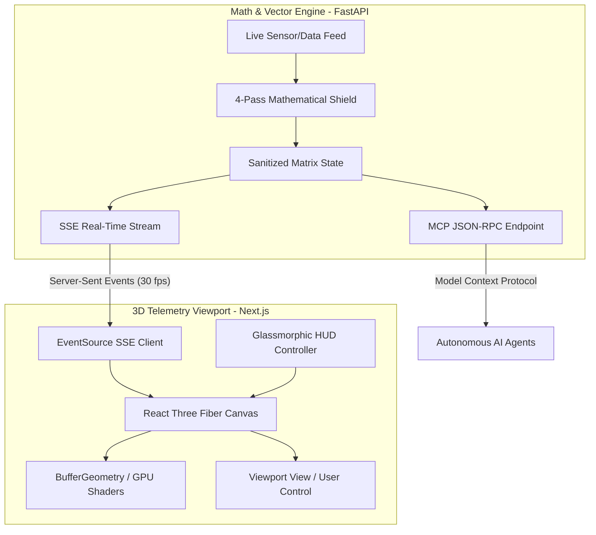

# 👁️ IYE — The Intelligence of Seeing

> An elite, high-performance 3D spatial telemetry visualization engine with a pristine minimalist aesthetic. Decoupled, production-ready, and architected for real-time computational rendering.

```
                    .───.
                   /     \
                  |  👁️  |   IYE ENGINE V1.0
                   \     /
                    '───'
    [SLATE GRAY BACKGROUNDS]  |  [SAGE GREEN ACCENTS]
  [GLASSMORPHIC HUD OVERLAYS] |  [MONOSPACED TELEMETRY]
```

---

## 🌌 Project Identity & Philosophy

**IYE** (derived from *Eye*) is built on a single, uncompromising principle: **A system is only as clear as the layout that renders it visible.** 

Designed with an elite minimalist palette, IYE avoids unnecessary visual noise to focus strictly on spatial telemetry and geometric structures:
- **Primary Canvas Background**: Deep OLED/Slate Gray (`#090d10`)
- **Interactive Vectors & Accents**: Luminescent Sage Green (`#8bb39c` / `#a3c9b4`)
- **System HUD & Controls**: High-transparency glassmorphic overlay panels with subtle backdrop-blur and precise monospaced typography.

---

## 🏗️ Core Decoupled Architecture

IYE is built as a highly performant, decoupled dual-engine system. By separating heavy mathematical vector validation from real-time GPU-accelerated graphics rendering, IYE achieves consistent 60 FPS performance even under intense streaming loads.



### 1. Python Math/Vector Matrix Engine (`iye-backend`)
* **Framework**: FastAPI (built for ultra-low latency async request cycles).
* **Core IP**: Powered by a stateless, high-performance **17-point verification and healing battery** in `vector_engine.py` using raw vectorised NumPy.
* **The 4-Pass Mathematical Shield**:
  1. *Dtype Coercion*: Safely forces all incoming tensors into `float32` representations.
  2. *Finite Verification*: Dynamic sweeps that instantly convert `NaN`, `Inf`, and `-Inf` coordinates into a stable origin point.
  3. *Magnitude Clamp*: Sign-preserving scale factor adjustment to clamp runaway velocities under a strict safety ceiling ($1.0 \times 10^6$).
  4. *Null-Vector Guard*: Injects an $\epsilon$-nudge ($1.0 \times 10^{-6}$) on the $v_x$ component to prevent downstream division-by-zero errors in directional shaders.
* **Integrations**: Surfaces standard Server-Sent Events (SSE) data streams on `/stream/field` and provides a native Model Context Protocol (MCP) JSON-RPC endpoint for autonomous AI agents to request real-time geometry statistics.

### 2. 3D Spatial Telemetry Viewport (`iye-frontend`)
* **Framework**: Next.js 14, TypeScript, React 18, and TailwindCSS.
* **Graphics Core**: Three.js integrated via React Three Fiber (`@react-three/fiber`) and Drei (`@react-three/drei`).
* **Performance Architecture**: Builds vertices directly into single-buffer GPU arrays (`BufferGeometry`), avoiding high-frequency heap allocations and garbage collection pauses.
* **Glassmorphic HUD**: Floating overlay panel tracking stream latency, dynamic vector counts, maximum mathematical magnitudes, and vector density centroids in real-time.

---

## 📂 Project Structure

```
openiye.com/
├── README.md                  # Stunning Open-Source Blueprint (this file)
├── .gitignore                 # Pristine system, python, and next.js exclusion rules
├── iye/                       # Master systematics & architecture documents
│   ├── IYE_Deep_Vision.md
│   └── IYE_Systematics.md
│
├── iye-backend/               # Python Ingestion & Analytics Pipeline
│   ├── main.py                # FastAPI server and SSE event generator (Port 8787)
│   ├── vector_engine.py       # NumPy-backed 4-Pass Mathematical Shield & 17-point test suite
│   └── requirements.txt       # Dependencies (FastAPI, NumPy, Uvicorn, Pydantic)
│
└── iye-frontend/              # Next.js 3D Rendering Viewport
    ├── app/                   # Next.js App Router layout and root viewport page
    ├── components/            # HUD panels & Three.js Canvas components
    │   ├── HUDPanel.tsx       # Glassmorphic monospaced telemetry controller
    │   └── VectorCanvas.tsx   # React Three Fiber / WebGL rendering layer
    ├── package.json           # Node packages, dependencies, and launch scripts
    └── tsconfig.json          # Strict TypeScript configurations
```

---

## 🚀 Local Quickstart Guide

This quickstart guides contributors and our team in Japan to spin up both modules simultaneously in local development mode.

### Prerequisites
- **Python**: Version `3.10` or higher
- **Node.js**: Version `18.x` or higher (packaged with `npm` or `yarn`)
- **Git**: Installed and configured

---

### Step 1: Clone and Stage the Repository
```bash
# Clone the repository locally
git clone https://github.com/openiye/iye.git
cd iye
```

---

### Step 2: Launch the Math & Vector Engine (Backend)

We run the backend on port `8787` by default.

```bash
# Navigate to the backend directory
cd iye-backend

# Create and activate a clean virtual environment
python -m venv .venv

# On Windows (PowerShell):
.venv\Scripts\Activate.ps1
# On macOS / Linux:
source .venv/bin/activate

# Install high-performance matrix dependencies
pip install -r requirements.txt

# Run the 17-point mathematical assertion battery to verify compiler sanity
python vector_engine.py

# Launch the FastAPI live stream engine
python main.py
```
> 💡 *The FastAPI engine is now running at `http://127.0.0.1:8787` with interactive API docs at `/docs` and the live SSE vector feed streaming at `/stream/field`.*

---

### Step 3: Launch the 3D Telemetry Viewport (Frontend)

Open a new terminal window or tab, leaving the backend running, and execute:

```bash
# Navigate to the frontend directory
cd iye-frontend

# Install node dependencies
npm install

# Start the Next.js development server
npm run dev
```
> 💡 *The frontend interactive viewport is now spinning at `http://localhost:3000`. Navigate there in your browser to witness the real-time 3D spatial field render.*

---

### ⚡ Running Concurrently (Pro-tip)
To speed up local telemetry iteration, you can run both backend and frontend processes simultaneously in a single terminal session using tools like `concurrently` (configured in root workspace if desired), or simply launch two dedicated terminal tabs side-by-side.

---

## 🛡️ Math Engine Verification Status

The vector math shield contains a self-contained 17-point test harness inside `vector_engine.py` verifying mathematical correctness of vector clamping, NaN sweep healing, and structural integrity.

To execute the test battery at any time:
```bash
cd iye-backend
python vector_engine.py
```

### Verification Matrix
| Test Case | target | Validation Logic | Status |
|---|---|---|---|
| **T01** | NaN Sweep | All `NaN` rows must be safely healed into the finite coordinate space | `[PASS]` |
| **T02** | Inf Sweep | Absolute positive infinity matrices are converted to stable system zeroes | `[PASS]` |
| **T03** | -Inf Sweep | Negative infinity components are securely zeroed | `[PASS]` |
| **T04-T05** | Dtype Coercion | Promotion and casting of `int64` and `float64` input down to optimized `float32` | `[PASS]` |
| **T06-T07** | Clamping | Vector magnitude peaks clamped to ceiling while preserving orientation signs | `[PASS]` |
| **T08-T09** | Null Nudge | Injection of $\epsilon$-displacement on empty velocity vectors to prevent division-by-zero | `[PASS]` |
| **T10** | Sanitization | Verified zero mutation rate for clean matrices passing through the engine | `[PASS]` |
| **T11-T12** | Overflow & Mixed | Safe handling of large Python integers and mixed healthy/corrupt data rows | `[PASS]` |
| **T13** | Auto Promotion | Automatic promotion of rank-1 vectors to standard row-matrix representations | `[PASS]` |
| **T14-T17** | Stress & Non-Destructive | 100,000 continuous vector load test; verified non-mutating copy-on-write integrity | `[PASS]` |

---

## 🤝 Contribution Protocol & Code Style

We follow strict design guidelines to maintain visual elegance and computational stability:
1. **Zero-Retention Principle**: Do not design endpoints that persist raw user vectors. Keep coordinate memory strictly ephemeral.
2. **Modern Monospaced Accents**: Any new telemetry HUD overlay must strictly use CSS variables mapped to the main Sage Green HSL colors (`hsl(146, 23%, 62%)`).
3. **TypeScript Strictness**: Any modifications to the 3D viewport components in `VectorCanvas.tsx` must maintain full type safety and zero use of `any`.

---

## 🎌 For Team Collaboration (Tokyo ⇄ Global)
*If you are running from our Tokyo office, ensure your shell environment is configured to standard UTF-8 before launching the vector test suite to render diagnostic signs correctly.*

```bash
# Set UTF-8 encoding in PowerShell
$OutputEncoding = [System.Text.Encoding]::UTF8
```

For immediate assistance or integration access, ping the developer channels on Slack or file an issue directly in the local tracking repository.

---
**IYE Engine** — *The intelligence of seeing, structured mathematically, visualized beautifully.*
